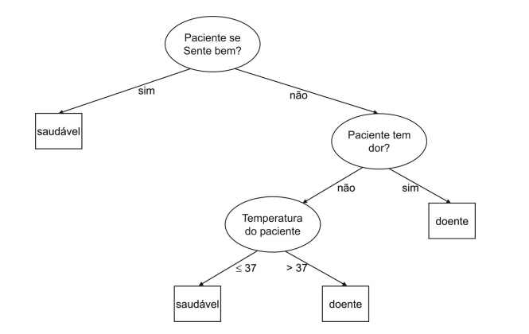

```{r setup, include=FALSE}
knitr::opts_chunk$set(
  echo = FALSE, 
  message = FALSE, 
  warning = FALSE,
  cache = FALSE,
  #engine.path = list(r = '', pyton = ''), 
  tidy = "formatR", tidy.opts = list(width.cutoff = 60), #tidy = "styler", 
  fig.align = "center", fig.pos = "h", fig.height = 3, fig.width = 5
  )
options(
  digits = 2, 
  OutDec = ".", 
  digits = 2, scipen = 4, 
  xtable.comment = FALSE
  )
```


\begin{titlepage} 

\begin{center} 
{\large Universidade Estadual de Campinas}\\[0.2cm] 
{\large Instituto de Matemática, Estatística e Computação Científica}\\[0.2cm] 
{\large Departamento de Estatística - ME714}\\[4cm]

{\bf \huge Desgaste de funcionários e suas possíveis causas: uma análise e previsão utilizando árvore de decisão ID3}\\
{\bf \Large Trabalho Final - Grupo 14}\\[6cm]


{\large Wesley Cabral Alvez, RA: 225825}\\[0.2cm]
{\large Nathan Brusamarello De Souto, RA: 222854}\\[0.2cm]
{\large Helton Marinho De Ávila, RA: 174471}\\[0.2cm]
{\large Natainá Novaes Silva Barbosa, RA: 242290}\\[1cm]

{\large Prof. Dra. Hildete Prisco Pinheiro}\\[1cm]

{\large Campinas}\\[0.2cm]
{\large 2021}
\end{center}

\end{titlepage}

\begin{abstract}

O projeto tem como intuito compreender os fatores que podem levar ao desgaste de funcionários e criar um modelo de previsão quanto a esse tipo de ocorrência a partir do banco de dados HR Employee Attrition, disponibilizado pela IBM. Com esse propósito inicial foi aplicado o método Árvore de Decisão ID3, através do qual foi possível identificar as variáveis mais decisivas para o funcionário ter ou não desgaste. O principal artigo de referência desse trabalho foi o "Induction of decision trees" de J. Ross Quinlan [8] e a matéria "Qual é a diferença entre turnover e desgaste de funcionários?" do site Xerpay [1].

\end{abstract}

\newpage

\tableofcontents

\newpage


# Introdução

A área de recursos humanos é a responsável pelos bens mais valiosos de uma empresa: os seus funcionários. Logo, é comum que a maioria dos desafios que ela enfrenta influenciem diretamente em eixos essenciais para o desenvolvimento e gestão de uma organização.

Um dos fenômenos inerentes à área de recursos humanos é o desgaste de funcionários. Também chamado de atrito (do termo em inglês “attrition”), esse problema é caracterizado pela saída de um colaborador da empresa e pode ser considerado como a ordem natural de sua jornada. Porém, há muitos motivos que podem culminar na saída de um colaborador da organização, desde problemas internos que ele pode ter enfrentado, problemas pessoais, sua aposentadoria ou até mesmo necessidade por parte da empresa de eliminar sua função (neste caso, não fazendo a contratação de um outro colaborador de imediato e deixando aquela posição vaga). [1]

Esse problema tornou-se recorrente no mercado de tecnologia nos últimos anos. Segundo Michael Booz, Gerente Sênior do Programa de Insights da rede social de negócios LinkedIn, empresas de tecnologia lutam com a retenção de talentos e exibem uma taxa de rotação de funcionários de 13.2%, superior a qualquer outro setor empresarial. [3] Mesmo startups do Vale do Silício, que encantam os funcionários ao apostarem em ambientes de trabalho deslumbrantes e com benefícios diferenciados, demonstram dificuldades a reter seus funcionários: em 2017, a média de carreira na startup de transporte privado urbano Uber era de apenas 1,8 anos. [4]

Dessa forma, fica claro que o desgaste de funcionários é um problema que afeta todos os negócios independentemente da natureza de seu segmento ou porte. A saída de colaboradores pode, além de afetar os resultados, criar custos significativos para uma empresa, tais como aqueles referentes à possível interrupção de processos e à contratação de novos funcionários e seus treinamentos. Assim sendo, torna-se de interesse gerencial compreender os fatores que culminam no fenômeno de desgaste de colaboradores e evitar que isso afete negativamente os negócios da organização.

Nesse contexto, a visualização de uma árvore de decisão dos processos que levariam ao fenômeno do desgaste de funcionários de uma empresa se mostra um recurso de grande valia para o auxílio à tomada de decisão da área de recursos humanos. 

Uma árvore de decisão é um recurso gráfico que mapeia os possíveis resultados de uma série de escolhas relacionadas, permitindo que uma organização compare possíveis ações com base em seus custos, probabilidades e benefícios. O método ID3 é um algoritmo para construção de árvore de decisão amplamente aplicado nas mais diversas áreas de estudo. Entre os benefícios de sua aplicação destacam-se o fato de que a construção de uma pequena árvore é feita em um tempo relativamente curto, além de que regras de previsão compreensíveis são criadas a partir dos dados de treinamento. [5]

# Objetivo

Partindo da problemática de desgaste (atrito), o presente relatório tem como propósito levantar a discussão sobre ela no segmento tecnológico, utilizando-se de um banco de dados ("HR Employee Attrition" [10]) disponibilizado pela IBM que apresenta informações sobre os funcionários da empresa. Os métodos utilizados neste projeto consistem em uma análise dos atributos e criação de um modelo utilizando o método Árvore de Decisão ID3, com o intuito de compreender os atributos que levam ao fenômeno de atrito e servir como aporte para prever a ocorrência de desgaste de funcionários da empresa e compreendê-la. Todas as manipulações e aplicações de métodos foram feitas utilizando a linguagem R atráves do RStudio. [11]

# Metodologia

## Árvore de Decisão ID3

As Árvores de Decisão são métodos práticos de aprendizagem indutiva para aproximação de funções de valores discretos [5]. Isto é, elas agrupam os dados com base em sequências de testes semelhantes a testes cognitivos (binários ou multinomiais) e chegam a um determinado agrupamento das informações com base nestas operações. Uma árvore de decisão é uma estrutura de dados definida recursivamente como: [6,8]

\begin{enumerate}
  \item \emph{nó decisão} que contém um teste sobre algum atributo da instância. Para cada resultado do teste existe uma aresta para uma subárvore. Cada subárvore tem a mesma estrutura que a árvore;
  \item \emph{nó folha} que corresponde a uma classificação final.
\end{enumerate}
  
Na Figura \ref{fig:exemplo} há um exemplo simples dessa metodologia para o diagnóstico de um paciente. Nela pode-se ver os nós citados acima. Os nós em formato redondo são os \emph{nós decisão} e os de formato retangular são os \emph{nós folha}. O primeiro nó da árvore é também chamado de \emph{nó raiz}. [6]
  
```{r pressure, echo=FALSE, fig.cap="Uma árvore de decisão simples para o diagnótico de um paciente.\\label{fig:exemplo}",out.width = '70%'}

```

Existem diferentes algoritmos de aplicação desse método com diferentes formas de escolher os testes nos \emph{nós decisão}, tipo de variáveis utilizadas, velocidade de execução, entre outros fatores [7].

Neste projeto, será utilizado o algoritmo ID3 desenvolvido por Quinlan [8]. Esse método pertence à família de algoritmos \emph{Top Down Induction of Decision Trees} - TDIDT, ou seja, árvores que são construídas de cima para baixo. O algoritmo ID3 é um dos únicos algoritmos que somente recebe dados discretos e sua fórmula de escolha dos atributos a serem testados nos \emph{nós decisão} é o Information Gain. 

## Information Gain

O Information Gain ou Ganho de Informação é uma medida quantitativa dos atributos que mede o quão bem ele separa os exemplos de treinamento de acordo com a classificação alvo. Ele consiste em calcular a redução esperada na entropia causada pela partição dos exemplos de acordo com o atributo. [5]

Sua fórmula é $$Gain(A) = I(p,n) - E(A)$$, em que $I(p,n)$ é a entropia de todo conjunto e $E(A)$ é o valor esperado da entropia do atributo A.

A entropia caracteriza a impureza de uma coleção árbitrária de exemplos. Neste algoritmo ela consiste em calcular o número de bits esperados necessários para codificar uma classificação. Como este estudo se atém a variáveis binárias, seu cálculo é $$I(p,n) = - \frac{p}{p+n}log_2\frac{p}{p+n} - \frac{n}{p+n}log_2\frac{n}{p+n}$$, em que $n$ é a quantidade de classificações negativas e $p$ é a quantidade de classificações positivas. A entropia pode ir de 0 a 1, sendo 1 a "maior impureza", obtida quando os dados estão perfeitamente divididos, e 0 a "menor impureza", quando todas as observações pertencem a somente uma das categorias. [8]

Com isso, o valor esperado da entropia do atributo A têm a seguinte fórmula $$E(A) = \sum_{i=1}^v \frac{p_i + n_i}{p + n}I(p_i,n_i)$$, em que $v$ é a quantidade de categorias do atributo A, $n_i$ é a quantidade de classificações negativas na categoria $i$ e $p_i$ é a quantidade de classificações positivas na categoria $i$. [8]

Além de definir quais são os melhores atributos a serem incorporados na árvore de decisão, a medida Information Gain também é utilizada pelo algoritmo para ajustar da melhor forma todas as variáveis para serem categóricas binárias. Ele segue o procedimento:

\begin{enumerate}
  \item caso a varíavel seja categórica binária, ou númerica binária, o algoritmo mantém o formato da variável;
  \item caso a variável seja categória com 3 ou mais categorias, o algoritmo seleciona a melhor divisão das categorias em 2 subgrupos e a torna em uma variável categórica binária. Essa seleção dos subgrupos é feita escolhendo o melhor Information Gain de todas as possíveis divisões; [5]
  \item caso a variável seja númerica, o algoritmo seleciona o melhor valor $c$, que pertence ao intervalo da variável, para separá-la em 2 intervalos, em que um será o intervalo positivo e o outro será o negativo. Por exemplo: Caso $Salário <= 1000$ então positivo, se $Salário > 1000$ então negativo. Essa separação também é feita escolhendo o melhor Information Gain de todos os possíveis valores $c$ pertecentes ao intervalo. [5]
\end{enumerate}

## Número de Nós

Com os critérios definidos do funcionamento da árvore de decisão ID3, é possível criar uma árvore utilizando todas as variáveis dispóniveis como atributos nos \emph{nós decisão}. Porém, isso pode acabar super-ajustando os dados, fazendo com que o algoritmo funcione muito bem somente para o conjunto de treinamento.

Para evitar o super-ajuste, é realizada uma "poda" na árvore de decisão, definindo um número ótimo de nós e seus atributos. Para essa escolha, dentro do conjunto de treino, o algoritmo o separa em dois grupos: "treino" e "poda". A árvore é então criada a partir do grupo "treino" e é validada pelo grupo "poda". Essa poda é feita na quantidade de nós em que o erro de classificação começa a divergir entre o grupo "treino" e o gruopo "poda". Pode ser que não seja o menor erro dentro do conjunto de treino, mas assim não há o super-ajuste dos dados. [6].

Além disso, com os números de nós definidos, os atributos que se mantiveram na árvore também são os atributos que melhor classificam às informações, ou seja, possuem o maior Information Gain.

## Reamostragem Hold-Out

Para o processo de teste do algoritmo, será utilizada o método de Reamostragem Hold-out. Que consiste em separar o conjunto de dados em um conjunto de treino e conjunto de teste aleatoriamente. O algoritmo irá agrupar $\frac{2}{3}$ das informações no conjunto de treino e $\frac{1}{3}$ das informações no conjunto de teste.[2] Com isso, no final do ajuste da Árvore de Decisão ID3, será possível fazer uma última análise se o algoritmo se comporta bem aos dados.

# Dados

O banco de dados conta com 35 variáveis e 1470 observações. As variáveis são relacionadas ao trabalho e algumas relacionadas à vida pessoal dos funcionários, sendo tanto categóricas quanto numéricas.
As variáveis que foram mais performáticas para o modelo de árvore de decisão, ou seja, obtiveram um maior Information Gain, estão descritas na Tabela \ref{tab:desc_dados}.

\begin{table}[H]
\caption{Variáveis e suas descrições.}\label{tab:desc_dados}
\begin{tabular}{l|l}
\textbf{Variável (Atributo)} & \textbf{Descrição}                                              \\ \hline
HoraExtra                    & Se o funcionário costuma ou não fazer horas extras no trabalho. \\
StatusRelacionamento         & Status do relacionamento do funcionário                         \\
AnosColaboracao              & Quantidade de anos de colaboração                               \\
Cargo                        & Cargo na empresa                                                \\
NivelTrabalho                & Nível do plano de carreira atual                                \\
ViagemTrabalho               & Frequência de viagens a trabalho                                \\
AnosNaEmpresa                & Quantidade de anos na empresa                                   \\
Diaria                       & Salário bruto diário                                            \\
SatisfacaoTrabalho           & Satisfação do funcionário com o trabalho                        \\
Departamento                 & Departamento do funcionário                                     \\
NumEmpresasTrabalhadas       & Quantidade de empresas em que o funcionário já trabalhou        \\
Renda                        & Renda Familiar                                                  \\
NumeroEmpregados             & Número de empregados da empresa                                
\end{tabular}
\end{table}

## Análise descritiva

```{r}
library(tidyverse)
library(kableExtra)
library(caret)
require(rpart)
require(rpart.plot)
dados <- read_csv("WA_Fn-UseC_-HR-Employee-Attrition.csv")

dados = dados %>%
  select(-c(EmployeeCount, Over18, StandardHours))
dados$Attrition[dados$Attrition == 'Yes'] <- "Sim"
dados$Attrition[dados$Attrition == 'No'] <- "Nao"

dados$BusinessTravel[dados$BusinessTravel == 'Non-Travel'] <- "Nao Viaja"
dados$BusinessTravel[dados$BusinessTravel == 'Travel_Rarely'] <- "Viaja Raramente"
dados$BusinessTravel[dados$BusinessTravel == 'Travel_Frequently'] <- "Viaja Frequentemente"

dados$Department[dados$Department == 'Research & Development'] <- "Pesquisa e desenvolvimento"  
dados$Department[dados$Department == 'Sales'] <- "Vendas"  
dados$Department[dados$Department == 'Human Resources'] <- "RH"  

dados$EducationField[dados$EducationField == 'Human Resources'] <- "RH" 
dados$EducationField[dados$EducationField == 'Life Sciences'] <- "Ciencias" 
dados$EducationField[dados$EducationField == 'Marketing'] <- "Marketing" 
dados$EducationField[dados$EducationField == 'Technical Degree'] <- "Grau Tecnico" 
dados$EducationField[dados$EducationField == 'Medical'] <- "Medicina" 
dados$EducationField[dados$EducationField == 'Other'] <- "Outros"

dados$Gender[dados$Gender == 'Male'] <- "Masculino"  
dados$Gender[dados$Gender == 'Female'] <- "Feminino"  

dados$JobRole[dados$JobRole == 'Healthcare Representative'] <- "Assistente Medico" 
dados$JobRole[dados$JobRole == 'Laboratory Technician'] <- "Tecnico de Laboratorio" 
dados$JobRole[dados$JobRole == 'Human Resources'] <- "RH" 
dados$JobRole[dados$JobRole == 'Manager'] <- "Gerente" 
dados$JobRole[dados$JobRole == 'Manufacturing Director'] <- "Manufatura" 
dados$JobRole[dados$JobRole == 'Research Director'] <- "Pesquisador" 
dados$JobRole[dados$JobRole == 'Research Scientist'] <- "Pesquisador" 
dados$JobRole[dados$JobRole == 'Sales Executive'] <- "Vendedor" 
dados$JobRole[dados$JobRole == 'Sales Representative'] <- "Vendedor"

dados$MaritalStatus[dados$MaritalStatus == 'Single'] <- "Solteiro(a)"  
dados$MaritalStatus[dados$MaritalStatus == 'Married'] <- "Casado(a)"  
dados$MaritalStatus[dados$MaritalStatus == 'Divorced'] <- "Divorciado(a)"  

dados$OverTime[dados$OverTime == 'Yes'] <- "Sim"  
dados$OverTime[dados$OverTime == 'No'] <- "Nao"  

dados$Education[dados$Education == 1] <- "< Medio"
dados$Education[dados$Education == 2] <- "Superior"
dados$Education[dados$Education == 3] <- "Bacharel"
dados$Education[dados$Education == 4] <- "Mestrado"
dados$Education[dados$Education == 5] <- "Doutorado"

dados$EnvironmentSatisfaction[dados$EnvironmentSatisfaction == 1] <- "Baixo"
dados$EnvironmentSatisfaction[dados$EnvironmentSatisfaction == 2] <- "Medio"
dados$EnvironmentSatisfaction[dados$EnvironmentSatisfaction == 3] <- "Alto"
dados$EnvironmentSatisfaction[dados$EnvironmentSatisfaction == 4] <- "Muito Alto"

dados$JobInvolvement[dados$JobInvolvement == 1] <- "Baixo"
dados$JobInvolvement[dados$JobInvolvement == 2] <- "Medio"
dados$JobInvolvement[dados$JobInvolvement == 3] <- "Alto"
dados$JobInvolvement[dados$JobInvolvement == 4] <- "Muito Alto"

dados$JobSatisfaction[dados$JobSatisfaction == 1] <- "Baixo"
dados$JobSatisfaction[dados$JobSatisfaction == 2] <- "Medio"
dados$JobSatisfaction[dados$JobSatisfaction == 3] <- "Alto"
dados$JobSatisfaction[dados$JobSatisfaction == 4] <- "Muito Alto"

dados$RelationshipSatisfaction[dados$RelationshipSatisfaction == 1] <- "Baixo"
dados$RelationshipSatisfaction[dados$RelationshipSatisfaction == 2] <- "Medio"
dados$RelationshipSatisfaction[dados$RelationshipSatisfaction == 3] <- "Alto"
dados$RelationshipSatisfaction[dados$RelationshipSatisfaction == 4] <- "Muito Alto"

dados$PerformanceRating[dados$PerformanceRating == 1] <- "Baixo"
dados$PerformanceRating[dados$PerformanceRating == 2] <- "Medio"
dados$PerformanceRating[dados$PerformanceRating == 3] <- "Alto"
dados$PerformanceRating[dados$PerformanceRating == 4] <- "Muito Alto"

colnames(dados) <- c("Idade", "Desgaste", "ViagemTrabalho", 
                     "Diaria", "Departamento", "DistanciaCasa",
                     "Educacao", "AreaEducacao", "NumeroEmpregados",
                     "SatisfacaoAmbiental", "Sexo", "TaxaHoraria", 
                     "EnvolvimentoTrabalho", "NivelTrabalho", "Cargo",
                     "SatisfacaoTrabalho", "StatusRelacionamento", "Renda",
                     "TaxaMensal", "NumEmpresasTrabalhadas", "HoraExtra", 
                     "AumentoSalarial", "Desempenho", "SatisfacaoRelacionamento",
                     "Acoes", "AnosColaboracao", "TreinamentoAnoPassado",
                     "EquilibrioVidaTrabalho", "AnosNaEmpresa", "AnosNaFuncao",
                     "AnosUltimaPromocao", "AnosMesmoGerente")

dados$NivelTrabalho <- factor(dados$NivelTrabalho)
```

Para entender e visualizar melhor os dados e as variáveis, serão apresentadas algumas tabelas através de uma análise descritiva. Todas as variáveis já foram transformadas em binárias atráves do Information Gain, como citado na Metodologia. Portanto, está é uma análise das variáveis logo antes de serem utilizadas no ajuste da árvore de decisão ID3.

Na tabela \ref{tab:desgaste}, tem-se a quantidade de resgistros para cada tipo de resposta da variável Desgaste, assim como a proporção de cada resposta.

\begin{table}[H]
\centering
\caption{Informações da variável Desgaste}\label{tab:desgaste}
\begin{tabular}{rrr}
  \hline
Desgaste & Total & Frequência \\ 
  \hline
Sim & 237 & 0.16 \\ 
  Não & 1233 & 0.84 \\ 
   \hline
\end{tabular}
\end{table}

Nota-se que cerca de 16% dos funcionários da empresa tem um desgaste com o serviço e, para entender esses desgastes, o modelo de árvore de decisão resumirá quais das demais variáveis influenciam para a resposta do desgaste ser sim ou não.

Na tabela \ref{tab:desg_hrex}, encontra-se a relação entre a resposta de desgaste e a variável de horas extras através de uma tabela de contingência.

\begin{table}[H]
\centering
\caption{Hora Extra (a esquerda) X Desgaste (em cima).}\label{tab:desg_hrex}
\begin{tabular}{rrr}
  \hline
 & Nãoo & Sim \\ 
  \hline
Não & 0.896 & 0.104 \\ 
  Sim & 0.695 & 0.305 \\ 
   \hline
\end{tabular}
\end{table}

Percebe-se que os funcionários que fazem horas extras tem uma probabilidade maior de ter desgaste no serviço do que aqueles que não trabalham além da jornada.

A tabela \ref{tab:desg_status} mostra a relação entre a resposta de desgaste e a variável de status do relacionamento e as proporções dos grupos que formam.

\begin{table}[H]
\centering
\caption{Status Relacionamento (a esquerda) X Desgaste (em cima).}\label{tab:desg_status}
\begin{tabular}{rrr}
  \hline
 & Não & Sim \\ 
  \hline
Solteiro (a) & 0.745 & 0.255 \\ 
  Outros & 0.883 & 0.117 \\ 
   \hline
\end{tabular}
\end{table}

É possível observar que os funcionários que são solteiros tem uma probabilidade maior de ter desgaste no serviço do que aqueles que são casados ou divorciados.

Na tabela \ref{tab:desg_cargo}, encontra-se a relação entre a resposta de desgaste e a variável de cargo através de uma tabela de contingência.

\begin{table}[H]
\centering
\caption{Cargo (a esquerda) X Desgaste (em cima).}\label{tab:desg_cargo}
\begin{tabular}{rrr}
  \hline
 & Não & Sim \\ 
  \hline
pesquisador, tecnico de laboratorio e vendedor & 0.807 & 0.193 \\ 
Demais cargos & 0.916 & 0.084 \\ 
   \hline
\end{tabular}
\end{table}

Percebe-se que os funcionários que são pesquisadores ou tecnicos de laboratório ou vendedores tem uma probabilidade maior de ter desgaste no serviço do que aqueles que não possuem um desses cargos.

Na tabela \ref{tab:desg_viaja}, encontra-se a relação entre a resposta de desgaste e a variável de cargo através de uma tabela de contingência.

\begin{table}[H]
\centering
\caption{Viaja a trabalho (a esquerda) X Desgaste (em cima).}\label{tab:desg_viaja}
\begin{tabular}{rrr}
  \hline
 & Não & Sim \\ 
  \hline
viaja frequentemente & 0.751 & 0.249 \\ 
Outros & 0.859 & 0.141 \\ 
   \hline
\end{tabular}
\end{table}

Percebe-se que os funcionários que viaja frequentemente tem uma probabilidade maior de ter desgaste no serviço do que aqueles que não viaja ou viaja raramente.


Na tabela \ref{tab:desg_satistrab}, encontra-se a relação entre a resposta de desgaste e a variável de satisfação no trabalho através de uma tabela de contingência.

\begin{table}[H]
\centering
\caption{Satisfação no trabalho (a esquerda) X Desgaste (em cima).}\label{tab:desg_satistrab}
\begin{tabular}{rrr}
  \hline
 & Não & Sim \\ 
  \hline
Alto, baixo e médio & 0.817 & 0.183 \\ 
Muito Alto & 0.887 & 0.113 \\ 
   \hline
\end{tabular}
\end{table}

Percebe-se que os funcionários que tem uma satisfação muito alta no trabalho tem uma probabilidade menor de ter desgaste no serviço do que aqueles que não tem a satisfação muito alta.

Na tabela \ref{tab:desg_depar}, encontra-se a relação entre a resposta de desgaste e a variável de departamento através de uma tabela de contingência.

\begin{table}[H]
\centering
\caption{Departamento (a esquerda) X Desgaste (em cima).}\label{tab:desg_depar}
\begin{tabular}{rrr}
  \hline
 & Não & Sim \\ 
  \hline
Vendas & 0.794 & 0.206 \\ 
Outros departamentos & 0.858 & 0.142 \\ 
   \hline
\end{tabular}
\end{table}

Percebe-se que os funcionários que pertencem ao departamento de vendas tem uma probabilidade maior de ter desgaste no serviço do que aqueles que pertence ao RH ou ao departamento de pesquisa e desenvolvimento.

Na tabela \ref{tab:desg_renda}, encontra-se a relação entre a resposta de desgaste e a variável de renda através de uma tabela de contingência.

\begin{table}[H]
\centering
\caption{Renda (a esquerda) X Desgaste (em cima).}\label{tab:desg_renda}
\begin{tabular}{rrr}
  \hline
 & Não & Sim \\ 
  \hline
'< 4056' & 0.752 & 0.248 \\ 
'>= 4056' & 0.892 & 0.108 \\ 
   \hline
\end{tabular}
\end{table}

Percebe-se que os funcionários que possuem uma renda inferior ao valor de 4.056 tem uma probabilidade maior de ter desgaste no serviço do que aqueles que possuem uma renda mensal superior ou igual a esse valor.

Na tabela \ref{tab:desg_col}, encontra-se a relação entre a resposta de desgaste e a variável de anos de colaboração através de uma tabela de contingência.

\begin{table}[H]
\centering
\caption{Anos de Colaboração (a esquerda) X Desgaste (em cima).}\label{tab:desg_col}
\begin{tabular}{rrr}
  \hline
 & Não & Sim \\ 
  \hline
'< 3' & 0.561 & 0.439 \\ 
'>= 3' & 0.864 & 0.136 \\ 
   \hline
\end{tabular}
\end{table}

Percebe-se que os funcionários que trabalham na empresa há menos de 3 anos tem uma probabilidade maior de ter desgaste no serviço do que aqueles que colaboram com a empresa há mais tempo.

Na tabela \ref{tab:desg_nivel}, encontra-se a relação entre a resposta de desgaste e a variável de nível no trabalho.

\begin{table}[H]
\centering
\caption{Nível no trabalho (a esquerda) X Desgaste (em cima).}\label{tab:desg_nivel}
\begin{tabular}{rrr}
  \hline
 & Não & Sim \\ 
  \hline
igual a 1 & 0.737 & 0.263 \\ 
diferente de 1 & 0.889 & 0.101 \\ 
   \hline
\end{tabular}
\end{table}

Tem-se que os funcionários que possuem um nível no trabalho igual a 1 tem uma probabilidade maior de ter desgaste no serviço do que aqueles que possuem um nível diferente de 1.

Na tabela \ref{tab:desg_anos}, encontra-se a relação entre a resposta de desgaste e a variável de Anos na empresa.

\begin{table}[H]
\centering
\caption{Anos na empresa (a esquerda) X Desgaste (em cima).}\label{tab:desg_anos}
\begin{tabular}{rrr}
  \hline
 & Não & Sim \\ 
  \hline
'< 2' & 0.651 & 0.349 \\ 
'>= 2' & 0.871 & 0.129 \\ 
   \hline
\end{tabular}
\end{table}

Tem-se que os funcionários que possuem menos de 2 anos na empresa tem uma probabilidade maior de ter desgaste no serviço do que aqueles que possuem 2 ou mais anos na empresa.

Na tabela \ref{tab:desg_diaria}, encontra-se a relação entre a resposta de desgaste e a variável Diaria.

\begin{table}[H]
\centering
\caption{Diaria (a esquerda) X Desgaste (em cima).}\label{tab:desg_diaria}
\begin{tabular}{rrr}
  \hline
 & Não & Sim \\ 
  \hline
'< 1324' & 0.839 & 0.161 \\ 
'>= 1324' & 0.838 & 0.162 \\ 
   \hline
\end{tabular}
\end{table}

Tem-se que a probabilidade de desgaste para as duas categorias de diária são aproximadamente iguais.

Na tabela \ref{tab:desg_nume}, encontra-se a relação entre a resposta de desgaste e a variável número de empresas trabalhadas pelos funcionários.

\begin{table}[H]
\centering
\caption{Nº empresas trabalhadas (a esquerda) X Desgaste (em cima).}\label{tab:desg_nume}
\begin{tabular}{rrr}
  \hline
 & Não & Sim \\ 
  \hline
'< 5' & 0.854 & 0.146 \\ 
'>= 5' & 0.782 & 0.218 \\ 
   \hline
\end{tabular}
\end{table}

Tem-se que os funcionários que trabalhou em 5 ou mais empresas tem uma probabilidade maior de ter desgaste no serviço do que aqueles que trabalhou em menos de 5 empresas.

Na tabela \ref{tab:desg_empr}, encontra-se a relação entre a resposta de desgaste e a variável número de empregados.

\begin{table}[H]
\centering
\caption{Nº empregados (a esquerda) X Desgaste (em cima).}\label{tab:desg_empr}
\begin{tabular}{rrr}
  \hline
 & Não & Sim \\ 
  \hline
'< 919' & 0.847 & 0.153 \\ 
'>= 919' & 0.832 & 0.168 \\ 
   \hline
\end{tabular}
\end{table}

Tem-se que os funcionários que trabalham em uma empresa que possui mais de 918 funcionários tem uma probabilidade maior de ter desgaste no serviço do que aqueles que trabalham em uma empresa que tem menos funcionários.

# Aplicação

```{r}
dados$Desgaste = factor(dados$Desgaste, levels = c('Sim','Nao'))

set.seed(12345)

amostra <- sample(1:nrow(dados), (2/3)*1470)

train <- dados[amostra,]
test <- dados[-amostra,]

fit = rpart(formula = Desgaste ~ ., method = 'class', data = train, parms = list(split = 'information'))
```

A figura \ref{fig:arvore} mostra o resultado da aplicação da árvore de decisão ID3 para o problema proposto, tendo 8 níveis e 15 \emph{nós decisão} em sua estrutura, desencadeando em 16 \emph{nós folha}. Em cada nó de decisão um teste é feito, e se a resposta é "Sim" a árvore segue em sequência para a esquerda em outro nó; caso contrário, a árvore segue à direita. Como mencionado anteriormente, todas as variáveis foram transformadas em atributos categóricos binários para os testes nos \emph{nós decisão}, incluindo as variáveis numéricas. Nos \emph{nós folha}, está a proporção de indíviduos agrupados neles e quantos tiveram ou não desgaste. Por exemplo, o \emph{nó folha} mais a direita agrupou 67% dos funcionários como se não houvessem tido desgaste, porém 55 deles relataram desgaste e 597 realmente não o relataram. Independentemente do \emph{nó folha}, internamente à esquerda está a quantidade de pessoas com desgaste e à direita está a quantidade de pessoas sem desgaste.

```{r arvore, fig.width= 9.5, fig.height= 6, echo=FALSE, fig.cap="Árvore de decisão para o estudo de demissões em empresa.\\label{fig:arvore}",out.width = '70%'}
rpart.plot(fit, type=0, extra=101, box.palette="lightgreen", branch.lty = 2, nn=TRUE, cex=0.6, fallen.leaves = F, branch.col = "brown")
```

```{r}
# predict(fit, newdata = train, type = "class") %>%
#   table(train$Desgaste, .) %>%
#   confusionMatrix()

# Acurácia --> 0.89
```

Na Tabela \ref{tab:conf} estão as matrizes de confusão do conjunto de treino e do conjunto de teste. Na esquerda da matriz estão as medidas verdadeiras, e em cima encontram-se as predições atráves da árvore de decisão utilizada. Nota-se uma tendência em o algoritmo classificar mais indivíduos em "Não Desgaste" do que em "Desgaste".

A acurácia do treino foi de 89% enquanto a do teste foi de 86,7%. Como as acurácias foram próximas, é possível também afirmar que não houve um super-ajuste do classificador.

\begin{table}[H]
\centering
\caption{Matrizes de Confusão (Desgaste).}\label{tab:conf}
\begin{tabular}{lll|ll}
    & \multicolumn{2}{l|}{Treino} & \multicolumn{2}{l}{Teste} \\ \cline{2-5} 
    & Sim          & Nao          & Sim         & Nao         \\
Sim & 71           & 97           & 22          & 47          \\
Nao & 11           & 801          & 18          & 403        
\end{tabular}
\end{table}

```{r}
# predict(fit, newdata = test, type = "class") %>%
#   table(test$Desgaste, .) %>%
#   confusionMatrix()

# Acurácia --> 0.867
```

# Conclusão

Com a construção da árvore de decisão, a Figura \ref{fig:arvore} permite notar que os \emph{nós folha} com a resposta "Sim" para o desgaste tem uma proporção de indivíduos agrupados menor do que a resposta "Não", o que já era esperado dado que o conjunto de dados possui mais funcionários que não relataram desgaste do que o contrário, como mostra a Tabela \ref{tab:desgaste}.

Além disso, através da árvore é possível observar as possíveis causas de desgaste dos funcionários. Cada \emph{nó decisão} possui um atributo que obteve um Information Gain alto em comparação aos demais. Como explicado na Metodologia, o \emph{nó raiz} é o que possui o maior Information Gain, que decai ao longo dos níveis da árvore. 

Portanto, as variáveis que melhor diminuem a entropia dos dados são HoraExtra, StatusRelacionamento, AnosColaboracao e todas as demais que estão nos \emph{nós decisão} da árvore, isto é, são essas as variáveis mais decisivas para o funcionário ter ou não desgaste.

